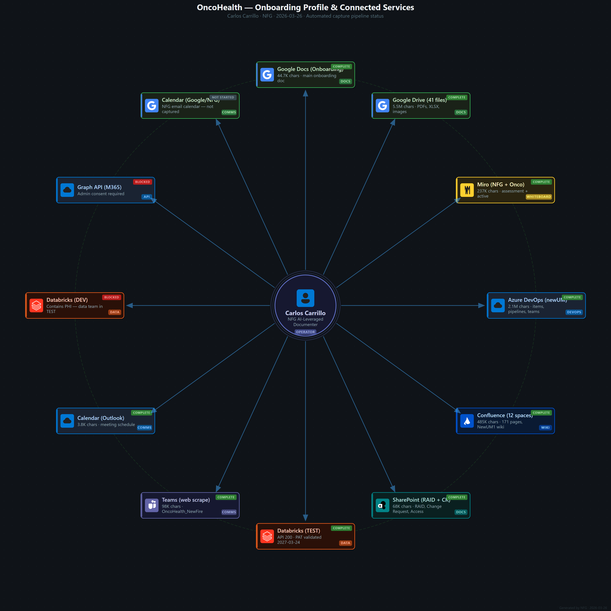

# OncoHealth — Sub-Client Profile

**Project**: newUM (New Utilization Management)
**Domain**: Healthcare / Oncology
**Purpose**: Replace end-of-life MATIS monolith with modern configurable UM case management engine

**Operator**: Carlos Carrillo (`ccarrillo@oncologyanalytics.com` / `ccarrillo@oncohealth.us`)
**SSO**: Okta + MFA (Okta Verify push)
**VPC**: CPC-ccarr-RY8W8 via [Windows 365](https://windows365.microsoft.com)

---

## Onboarding Status



## Connected Services Summary

| # | Service | Status | Chars | Script |
|---|---------|--------|-------|--------|
| 01 | Google Docs (Onboarding) | ✅ Complete | 44.7K | `scrape-gdoc-export.js` |
| 02 | Google Docs (Design Template) | ✅ Complete | 2.8K | `scrape-gdoc-export.js` |
| 03 | Miro NFG Board (stale) | ✅ Complete | 131K | `miro-api.js` |
| 04 | Miro Onco Board (active) | ✅ Complete | 106K | PDF export |
| 05 | Azure DevOps (newUM) | ✅ Complete | 2.1M | `scrape-ado-deep.js` |
| 06 | Confluence (12 spaces) | ✅ Complete | 485K | `scrape-confluence.js` |
| 07 | SharePoint RAID | ✅ Complete | 30K | `scrape-sharepoint-download.js` |
| 08 | SharePoint Change Request | ✅ Complete | 1.4K | `scrape-sharepoint-download.js` |
| 09 | Databricks TEST | ✅ Complete | API 200 | `scrape-databricks.js` |
| 10 | Team Access Inventory | ✅ Complete | 37K | `scrape-sharepoint-download.js` |
| 11 | Google Drive (41 files) | ✅ Complete | 5.5M | `scrape-gdrive-folder.js` |
| — | Teams (web scrape) | ✅ Complete | 98K | `scrape-teams-calendar.js` |
| — | Calendar (Outlook) | ✅ Complete | 3.8K | `scrape-teams-calendar.js` |
| 09b | Databricks DEV | 🚫 Blocked | — | Contains PHI |
| — | Graph API (M365) | 🚫 Blocked | — | Admin consent required |
| — | Calendar (Google/NFG) | ⬜ Not Started | — | — |

## Key Files

| File | Purpose |
|------|---------|
| `client.yaml` | Service registry, auth, team roster |
| `knowledge.json` | Confirmed facts & unknowns (v1.14.0) |
| `onboarding-diagram.json` | Diagram config (regenerate with `render-diagram.js`) |
| `output/` | All captured content by source |
| `tickets/` | Per-ticket investigation folders |

## Regenerate Diagram

```powershell
$env:PATH = "$env:LOCALAPPDATA\Programs\node\node-v22.15.0-win-x64;$env:PATH"
node shared/render-diagram.js --config clients/oncohealth/onboarding-diagram.json --out clients/oncohealth --png
```
