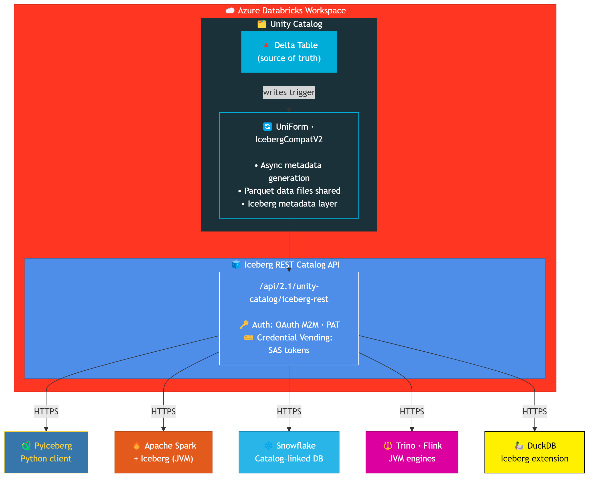
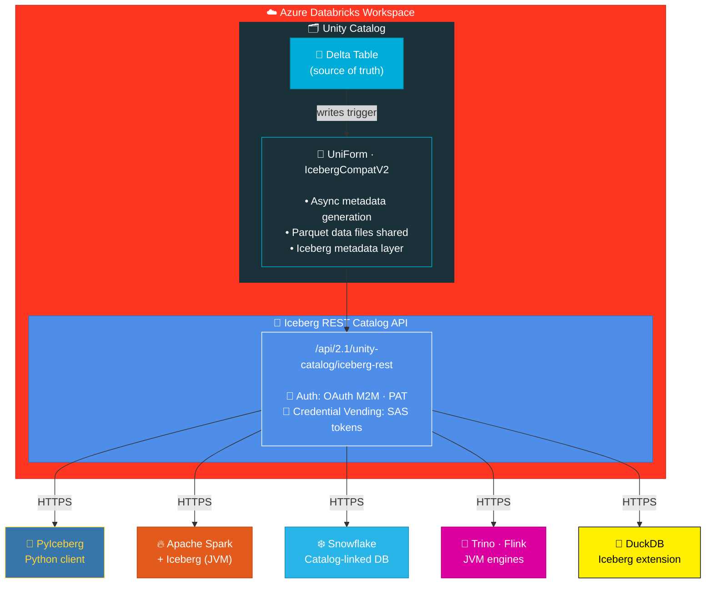
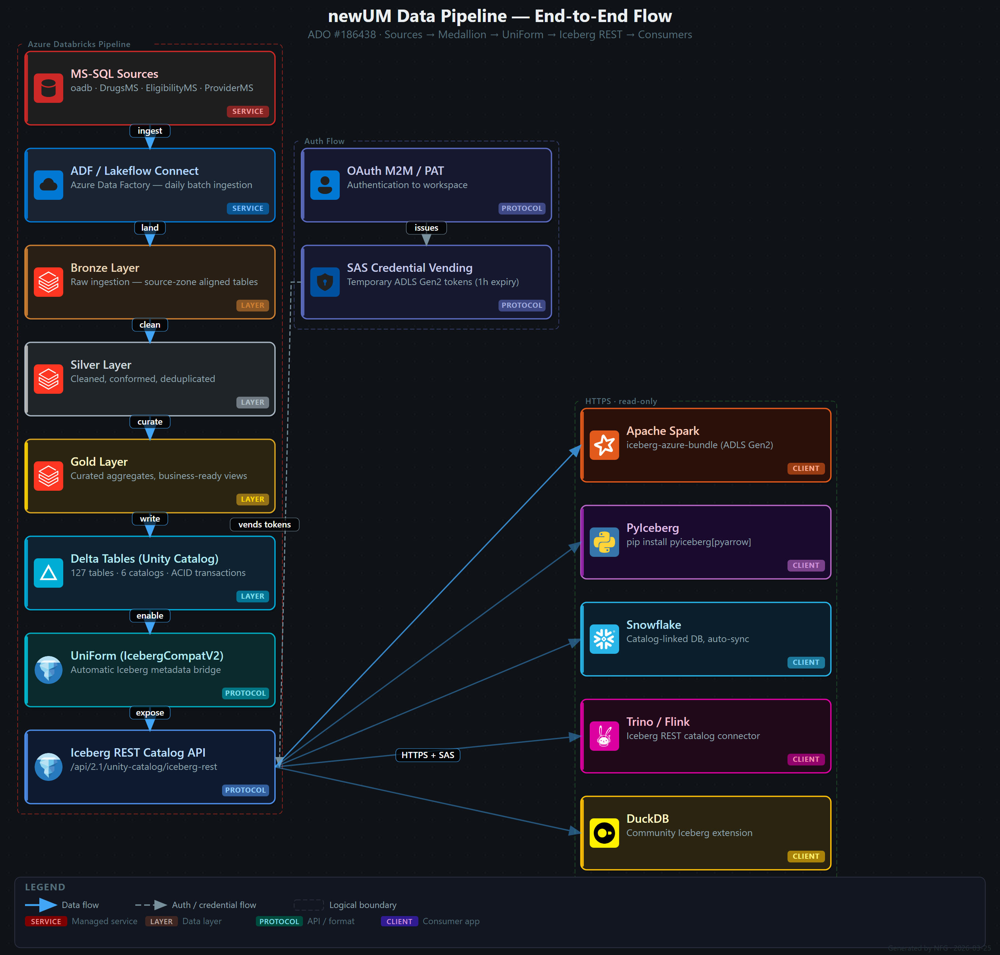
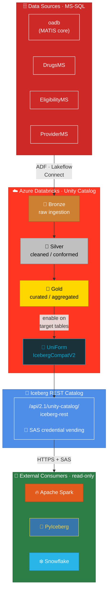

---
pdf_options:
  margin:
    top: 0mm
    bottom: 0mm
    left: 15mm
    right: 15mm
---

# Closure Note — Investigate Iceberg REST Catalog API Feasibility

**ADO Ticket**: [#186438](https://oncologyanalytics.visualstudio.com/newUM/_workitems/edit/186438)
**Area**: newUM\Data Team
**Sprint**: TBD
**Priority**: P2
**Sources**: All claims verified against official Microsoft Learn docs (fetched 2026-03-23) AND validated against TEST workspace API (2026-03-24). See [References](#references) for full list.
**Project context**: `clients/oncohealth/knowledge.json` v1.11.0 — operational facts cited as [K].

## Architecture Overview

Mermaid source (click to expand)

**Data flow**: Writes go through Databricks (Delta) → UniForm generates Iceberg metadata async →
External clients read via REST Catalog API → Credential vending provides temporary ADLS SAS tokens.

> Sources: [S1] endpoint + credential vending; [S2] UniForm async metadata generation.

### Applied to newUM

Mermaid source (click to expand)

The above architecture maps to our confirmed environment [K: `tech_stack.data`, `environments.databricks`]:

| Layer | newUM Reality | Source |
|-------|--------------|--------|
| **Delta tables** | Unity Catalog with Bronze/Silver/Gold medallion | [K: `tech_stack.data`] |
| **Workspace (DEV)** | `https://adb-3806388400498653.13.azuredatabricks.net/` — BLOCKED (contains PHI) | [K: `databricks.workspaces[0]`] |
| **Workspace (TEST)** | `https://adb-2393860672770324.4.azuredatabricks.net/` — access GRANTED via ticket #0035611 (2026-03-23) | [K: `databricks.workspaces[1]`] |
| **Workspace (UAT/PROD)** | URLs unknown | [K: `databricks.workspaces[2-3]`] |
| **PAT token** | `visualstudio-carlos` created, expires 2027-03-22 | [K: `access_inventory.results["Databricks test"]`] |
| **Auth method** | Entra ID button click required (Okta SSO does NOT auto-login to Databricks) | [K: `access_status.access_inventory.note`] |
| **Data Team Lead** | Michal Mucha — runs daily standups, Databricks Lakeflow Connect chat | [K: `key_contacts["Michal Mucha"]`] |
| **DevOps contact** | `devopsrequest@oncologyanalytics.com` | [K: `onboarding_documents.devops_email`] |
| **Target databases** | oadb (main), DrugsMS, EligibilityMS, ProviderMS — all MS-SQL, candidates for lakehouse migration | [K: `environments.databases`] |

## Cost Analysis — Is It Really Zero?

Short answer: **The Iceberg REST Catalog API itself has zero incremental licensing cost.** But that deserves a breakdown, because "zero" is surprising and the boss is right to question it.

### Why It Appears Free

The Iceberg REST Catalog API is **not a separate service** — it's a built-in endpoint within the existing Databricks workspace. Think of it like enabling HTTPS on a database that's already running. There is no:

- New compute cluster to provision
- New storage account to create
- New license tier to purchase
- Per-API-call billing (unlike, say, Azure API Management or AWS API Gateway)

This is a Databricks product strategy decision: they include it to make Unity Catalog more attractive vs. competitors (Snowflake, BigQuery) by positioning Databricks as the universal data lakehouse. The API is the "front door" — they want you using it.

### What Actually Costs Money (the fine print)

| Component | Cost | Who Pays | Already Paying? |
|-----------|------|----------|-----------------|
| Databricks workspace | DBU pricing (existing) | OncoHealth | **YES** — already running |
| Delta writes (trigger metadata gen) | Same cluster as current writes | OncoHealth | **YES** — writes happen regardless |
| Iceberg metadata files | ~KB per table version on ADLS | OncoHealth | **YES** — marginal, within existing storage |
| Driver memory overhead | +5-15% on write operations ([S2]) | OncoHealth | **YES** — uses existing cluster |
| Service principal (OAuth M2M) | $0 — Entra/Databricks feature | — | N/A |
| SAS credential vending | $0 — built into API response | — | N/A |
| Network egress (ADLS → reader) | Azure egress pricing if cross-region | Depends on reader location | **Only if cross-region** |
| Private Link (if required) | ~$7.30/month + $0.01/GB | OncoHealth | **Only if private networking needed** |

### The Real Cost: Operational, Not Financial

- **One-time setup**: Enable UniForm on target tables, grant EXTERNAL_USE_SCHEMA, enable external_access on metastore → ~2-4 hours of data engineer time
- **Ongoing**: Monitor metadata lag, ensure write clusters stay on DBR 14.3+ LTS → negligible if already on modern runtime
- **Risk**: Protocol upgrade is partially irreversible (Delta reader/writer version bumps can't be undone)

### Why Not Just Connect Directly to Parquet Files?

This is the key architectural question. The Delta Lake tables on ADLS Gen2 **are** Parquet files underneath. So why not just read them directly?

| Approach | Direct Parquet/Delta Read | Iceberg REST Catalog API |
|----------|--------------------------|-------------------------|
| **Auth** | Need ADLS storage keys or SAS tokens — must manage and rotate | API-level auth (PAT/OAuth) → automatic SAS credential vending with 1h expiry |
| **Schema** | Must parse `_delta_log/` JSON files to understand schema, partitions, and which Parquet files are current | Standard Iceberg catalog protocol — schema discovery built-in |
| **ACID** | Risk of reading partially-written transactions ("dirty reads") if you read Parquet mid-write | Iceberg metadata guarantees snapshot isolation — always reads a consistent version |
| **Governance** | No audit trail — direct storage access bypasses Unity Catalog permissions | All reads go through UC permissions → audit logs, column-level security, row filters |
| **Time Travel** | Must manually parse Delta log to find historical versions | Iceberg snapshots supported natively |
| **Deletion Vectors** | Must understand Delta's DV format to skip deleted rows — most Parquet readers can't | Handled transparently by Iceberg metadata layer |
| **Column Mapping** | Delta's column ID mapping means physical Parquet column names ≠ logical names — direct read returns wrong column names | Iceberg metadata maps logical ↔ physical correctly |
| **Client Support** | Raw Parquet read works in Spark/Python but breaks with schema evolution | PyIceberg, Spark, Snowflake, Trino, DuckDB — all have native Iceberg REST catalog connectors |
| **Security Compliance** | Gives external systems direct access to ADLS — storage-level blast radius | API-level access only — storage credentials are temporary (1h SAS tokens), scoped to specific tables |

**Bottom line**: Direct Parquet access is like giving someone the keys to the filing cabinet. Iceberg REST is like giving them a controlled API window where they can look at specific files, with an audit trail and automatic credential expiry. For a healthcare company handling PHI-adjacent data, the governance difference alone justifies the approach.

> Sources: [S1] credential vending + audit; [S2] UniForm metadata generation + resource impact; [S2] *"might increase the driver resource usage"*.

## Investigation Files

- Full report: `clients/oncohealth/tickets/186438-iceberg-rest-catalog/output.md`

## Pros

- **Zero data duplication** — Iceberg reads use same Parquet files as Delta; only metadata is generated ([S2]: *"A single copy of the data files serves multiple formats"*)
- **Native Azure Databricks support** — endpoint is built-in, no external infrastructure needed ([S1]: *"Unity Catalog provides an implementation of the Iceberg REST catalog API"*)
- **Broad client compatibility** — PyIceberg, Spark, Snowflake, Trino, Flink supported per [S1]; DuckDB via its own [Iceberg extension](https://duckdb.org/docs/extensions/iceberg.html) (not in Databricks docs)
- **Credential vending** — temporary SAS tokens issued automatically, default 1h expiry ([S1]: *"The default expiration time is one hour"*)
- **Low operational overhead** — metadata generation is automatic and async ([S2]: *"asynchronously after a Delta Lake write transaction completes"*)
- **Standards-based** — uses official [Apache Iceberg REST Catalog spec](https://github.com/apache/iceberg/blob/master/open-api/rest-catalog-open-api.yaml) ([S1])
- **Public Preview (DBR 16.4+)** — on GA track, production-viable with preview caveats ([S1]: *"Public Preview in Databricks Runtime 16.4 LTS and above"*)

## Cons

- **Read-only for Delta+UniForm tables** — external clients cannot write; writes must go through Databricks ([S2]: *"Iceberg client support is read-only. Writes are not supported."*)
- **Metadata lag** — Iceberg metadata generated asynchronously; may lag behind latest Delta version ([S2]: *"Delta table versions do not align with Iceberg versions"*)
- **Protocol upgrade partially irreversible** — Iceberg reads can be disabled by unsetting `delta.universalFormat.enabledFormats`, but Delta protocol version upgrades and column mapping **cannot** be undone ([S2]: *"You can turn off Iceberg reads by unsetting the delta.universalFormat.enabledFormats table property. Upgrades to Delta Lake reader and writer protocol versions cannot be undone."*)
- **Deletion vectors incompatible with Iceberg v2** — tables need `REORG` before enabling; however, **Iceberg v3 supports deletion vectors** ([S2]: *"Apache Iceberg v3 supports deletion vectors"*)
- **Public Preview status** — not yet GA; breaking changes possible (low risk given timeline) ([S1])
- **Snowflake+Entra requires public networking** — cannot use Private Link for Entra OAuth ([S1]: *"must use public networking when authenticating with an Entra service principal"*)

## Investigation Findings

| # | Finding | Result | Severity for Implementation |
|---|---------|--------|----------------------------|
| 1 | `external_access_enabled` is `false` on metastore | UC Admin must enable before any external Iceberg reads work | HIGH |
| 2 | No UniForm on any table — all at `minReaderVersion=1`, `minWriterVersion=2` (needs ≥2/≥7) | Protocol upgrade required per table; partially irreversible ([S2]) | HIGH |
| 3 | No `EXTERNAL_USE_SCHEMA` grant — only SELECT, USE_SCHEMA, MODIFY, CREATE_TABLE | UC Admin must grant per-schema | HIGH |
| 4 | Metadata staleness — Iceberg metadata generated async, may lag Delta writes | Monitor `converted_delta_version`; `MSCK REPAIR TABLE` as fallback | MEDIUM |
| 5 | Network — TEST workspace reachable externally via PAT (validated 2026-03-24) | No Private Link needed for API access | RESOLVED |
| 6 | Protocol upgrade partially irreversible — reader/writer version + column mapping can't be undone ([S2]) | Test on non-prod first; forward-compatible | LOW |
| 7 | Deletion vectors on existing tables — need REORG for Iceberg v2; v3 supports them natively ([S2]) | Schedule during maintenance; REORG is idempotent | LOW |

## Investigation Status: COMPLETE

All investigation objectives have been met:

| Objective | Status |
|-----------|--------|
| Endpoint accessibility | CONFIRMED — 12 API endpoints tested, all respond |
| Network connectivity | CONFIRMED — reachable from external network |
| UC inventory captured | COMPLETE — 8 catalogs, ~66 schemas, ~466 tables, 3 SPs |
| UniForm readiness assessed | COMPLETE — zero tables ready, prerequisites documented |
| Permissions gap identified | COMPLETE — missing `EXTERNAL_USE_SCHEMA` |
| Cost analysis | COMPLETE — zero incremental licensing; detailed breakdown above |
| "Why not direct Parquet?" | COMPLETE — 8-dimension comparison above |
| Implementation prerequisites | DOCUMENTED — 6 items for future ticket |

## References

All claims in this document were verified against official Microsoft Learn documentation, fetched 2026-03-23:

| ID | Title | URL | Last Updated |
|----|-------|-----|-------------|
| **[S1]** | Access Azure Databricks tables from Apache Iceberg clients | https://learn.microsoft.com/en-us/azure/databricks/external-access/iceberg | 2026-03-19 |
| **[S2]** | Read Delta tables with Iceberg clients (UniForm) | https://learn.microsoft.com/en-us/azure/databricks/delta/uniform | 2026-03-06 |
| **[S3]** | Enable external data access on the metastore | https://learn.microsoft.com/en-us/azure/databricks/external-access/admin#external-data-access | — |
| **[S4]** | Databricks service principals / Auth | https://learn.microsoft.com/en-us/azure/databricks/dev-tools/auth/ | — |
| **[S5]** | PyIceberg REST catalog configuration | https://py.iceberg.apache.org/configuration/#rest-catalog | — |
| **[S6]** | Apache Iceberg REST API spec | https://github.com/apache/iceberg/blob/master/open-api/rest-catalog-open-api.yaml | — |
| **[K]** | Project knowledge base | `clients/oncohealth/knowledge.json` v1.11.0 | 2026-03-25 |
| **[DB]** | Databricks TEST workspace API capture | `clients/oncohealth/output/databricks/` (7 files, 987 KB) | 2026-03-24 |
