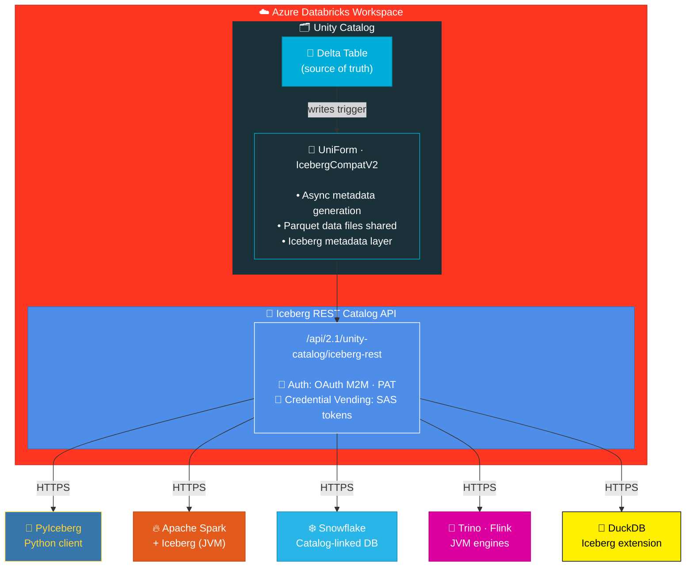
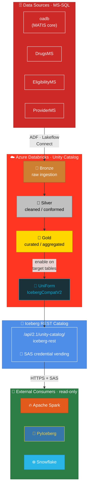

---
pdf_options:
  margin:
    top: 0mm
    bottom: 0mm
    left: 15mm
    right: 15mm
---

# Closure Note — Investigate Iceberg REST Catalog API Feasibility

**ADO Ticket**: [#186438](https://oncologyanalytics.visualstudio.com/newUM/_workitems/edit/186438)
**Area**: newUM\Data Team
**Sprint**: TBD
**Priority**: P2
**Sources**: All claims verified against official Microsoft Learn docs (fetched 2026-03-23). See [References](#references) for full list.
**Project context**: `clients/oncohealth/knowledge.json` v1.7.0 — operational facts cited as [K].

## Architecture Overview

Mermaid source (click to expand)

**Data flow**: Writes go through Databricks (Delta) → UniForm generates Iceberg metadata async →
External clients read via REST Catalog API → Credential vending provides temporary ADLS SAS tokens.

> Sources: [S1] endpoint + credential vending; [S2] UniForm async metadata generation.

### Applied to newUM

Mermaid source (click to expand)

The above architecture maps to our confirmed environment [K: `tech_stack.data`, `environments.databricks`]:

| Layer | newUM Reality | Source |
|-------|--------------|--------|
| **Delta tables** | Unity Catalog with Bronze/Silver/Gold medallion | [K: `tech_stack.data`] |
| **Workspace (DEV)** | `https://adb-3806388400498653.13.azuredatabricks.net/` — BLOCKED (contains PHI) | [K: `databricks.workspaces[0]`] |
| **Workspace (TEST)** | `https://adb-2393860672770324.4.azuredatabricks.net/` — access GRANTED via ticket #0035611 (2026-03-23) | [K: `databricks.workspaces[1]`] |
| **Workspace (UAT/PROD)** | URLs unknown | [K: `databricks.workspaces[2-3]`] |
| **PAT token** | `visualstudio-carlos` created, expires 2027-03-22 | [K: `access_inventory.results["Databricks test"]`] |
| **Auth method** | Entra ID button click required (Okta SSO does NOT auto-login to Databricks) | [K: `access_status.access_inventory.note`] |
| **Data Team Lead** | Michal Mucha — runs daily standups, Databricks Lakeflow Connect chat | [K: `key_contacts["Michal Mucha"]`] |
| **DevOps contact** | `devopsrequest@oncologyanalytics.com` | [K: `onboarding_documents.devops_email`] |
| **Target databases** | oadb (main), DrugsMS, EligibilityMS, ProviderMS — all MS-SQL, candidates for lakehouse migration | [K: `environments.databases`] |

## Cost Estimation

| Component | Cost Impact |
|-----------|-------------|
| Iceberg metadata generation | Runs on same compute as Delta writes — marginal increase in driver resource usage |
| Storage | Iceberg metadata files stored alongside Delta metadata — negligible (~KB per version) |
| API calls | REST Catalog API calls — included in Databricks pricing, no extra charge |
| Service principal | No additional licensing cost |
| Network | If Private Link required — Azure Private Link charges apply |
| **Total incremental cost** | **Near-zero** — no new compute or storage required |

> **Note**: Cost estimation is inferred from architecture described in [S2]. Databricks docs state metadata generation *"might increase the driver resource usage"* [S2] but provide no cost figures. For high-throughput write workloads, driver memory impact should be validated in TEST.

## Investigation Files

- Full report: `clients/oncohealth/tickets/186438-iceberg-rest-catalog/output.md`

## Pros

- **Zero data duplication** — Iceberg reads use same Parquet files as Delta; only metadata is generated ([S2]: *"A single copy of the data files serves multiple formats"*)
- **Native Azure Databricks support** — endpoint is built-in, no external infrastructure needed ([S1]: *"Unity Catalog provides an implementation of the Iceberg REST catalog API"*)
- **Broad client compatibility** — PyIceberg, Spark, Snowflake, Trino, Flink supported per [S1]; DuckDB via its own [Iceberg extension](https://duckdb.org/docs/extensions/iceberg.html) (not in Databricks docs)
- **Credential vending** — temporary SAS tokens issued automatically, default 1h expiry ([S1]: *"The default expiration time is one hour"*)
- **Low operational overhead** — metadata generation is automatic and async ([S2]: *"asynchronously after a Delta Lake write transaction completes"*)
- **Standards-based** — uses official [Apache Iceberg REST Catalog spec](https://github.com/apache/iceberg/blob/master/open-api/rest-catalog-open-api.yaml) ([S1])
- **Public Preview (DBR 16.4+)** — on GA track, production-viable with preview caveats ([S1]: *"Public Preview in Databricks Runtime 16.4 LTS and above"*)

## Cons

- **Read-only for Delta+UniForm tables** — external clients cannot write; writes must go through Databricks ([S2]: *"Iceberg client support is read-only. Writes are not supported."*)
- **Metadata lag** — Iceberg metadata generated asynchronously; may lag behind latest Delta version ([S2]: *"Delta table versions do not align with Iceberg versions"*)
- **Protocol upgrade partially irreversible** — Iceberg reads can be disabled by unsetting `delta.universalFormat.enabledFormats`, but Delta protocol version upgrades and column mapping **cannot** be undone ([S2]: *"You can turn off Iceberg reads by unsetting the delta.universalFormat.enabledFormats table property. Upgrades to Delta Lake reader and writer protocol versions cannot be undone."*)
- **Deletion vectors incompatible with Iceberg v2** — tables need `REORG` before enabling; however, **Iceberg v3 supports deletion vectors** ([S2]: *"Apache Iceberg v3 supports deletion vectors"*)
- **Public Preview status** — not yet GA; breaking changes possible (low risk given timeline) ([S1])
- **Snowflake+Entra requires public networking** — cannot use Private Link for Entra OAuth ([S1]: *"must use public networking when authenticating with an Entra service principal"*)

## Risks & Open Questions

| # | Risk/Question | Severity | Mitigation |
|---|---------------|----------|------------|
| 1 | **Workspace access not yet validated** — DEV (`adb-3806388400498653`) is BLOCKED (PHI); TEST (`adb-2393860672770324`) access granted but not yet tested [K: `databricks.workspaces`, `access_inventory`] | MEDIUM | Validate PAT against TEST workspace Iceberg endpoint |
| 2 | **Metadata staleness** — Iceberg metadata may lag Delta writes | MEDIUM | Monitor `converted_delta_version`; use `MSCK REPAIR TABLE` if needed |
| 3 | **Target tables unknown** — which Unity Catalog tables need UniForm? Bronze/Silver/Gold layers exist [K: `tech_stack.data`] but specific tables not yet identified | MEDIUM | Coordinate with Michal Mucha [K: `key_contacts`] for table selection |
| 4 | **Network restrictions** — DEV workspace already network-blocked for us [K: `access_inventory`]; TEST/UAT/PROD may have similar restrictions | MEDIUM | Validate firewall/VNet/Private Link config; contact DevOps (`devopsrequest@oncologyanalytics.com` [K]) |
| 5 | **External data access not enabled** — metastore may need admin config | MEDIUM | Requires UC Admin to enable; escalate via Erik Hjortshoj (SVP Engineering) [K: `key_contacts`] |
| 6 | **Protocol upgrade partially irreversible** — Iceberg reads can be toggled off, but Delta protocol versions and column mapping cannot be undone ([S2]) | LOW | Test on non-prod table first; protocol is forward-compatible |
| 7 | **Deletion vectors on existing tables** — need REORG for Iceberg v2; Iceberg v3 supports them natively ([S2]) | LOW | Schedule during maintenance window; REORG is idempotent |
| 8 | **Write via Iceberg not supported for Delta UniForm** — confirmed | INFO | Out of scope per ticket; writes stay in Databricks |
| 9 | **MFA blocks automation** — Databricks login requires Entra ID button click, not automated via Okta SSO like ADO/SharePoint [K: `access_inventory.note`] | LOW | Manual validation needed; user must be at keyboard |
| 10 | **Unresolved unknowns** — TEST/UAT/PROD URLs unknown (U2), preferred workspace unknown (U6) [K: `unknowns`] | MEDIUM | Resolve with Michal or DevOps before proceeding |

### Recommended Next Steps

1. ~~**Obtain TEST workspace URL**~~ — DONE: `https://adb-2393860672770324.4.azuredatabricks.net/` [K: `databricks.workspaces[1]`]
2. **Validate existing PAT** — token `visualstudio-carlos` (exp 2027-03-22) [K] → curl `https://adb-2393860672770324.4.azuredatabricks.net/api/2.1/unity-catalog/iceberg-rest/v1/config` (needs MFA at keyboard)
3. **List UC catalogs/tables** — use PAT to query TEST workspace; identify Bronze/Silver/Gold tables [K: `tech_stack.data`] for UniForm candidates
4. **Coordinate with Michal Mucha** [K: `key_contacts`] — he leads Databricks Lakeflow Connect [K: `communication.channels[0].active_chats`]; align on which tables to expose
5. **POC on test table** — enable UniForm, validate PyIceberg read from external network
6. **Create service principal** — with `USE CATALOG`, `USE SCHEMA`, `SELECT`, `EXTERNAL USE SCHEMA`; request via DevOps [K]
7. **Enable external data access** on metastore — escalate to UC Admin via Erik Hjortshoj [K: `key_contacts`]
8. **Document network path** — confirm external service can reach TEST workspace endpoint; DEV (`adb-3806388400498653`) is BLOCKED (PHI) [K]
9. **Resolve unknown U6** [K: `unknowns`] — preferred workspace for initial validation (TEST likely); UAT/PROD URLs still unknown

## References

All claims in this document were verified against official Microsoft Learn documentation, fetched 2026-03-23:

| ID | Title | URL | Last Updated |
|----|-------|-----|-------------|
| **[S1]** | Access Azure Databricks tables from Apache Iceberg clients | https://learn.microsoft.com/en-us/azure/databricks/external-access/iceberg | 2026-03-19 |
| **[S2]** | Read Delta tables with Iceberg clients (UniForm) | https://learn.microsoft.com/en-us/azure/databricks/delta/uniform | 2026-03-06 |
| **[S3]** | Enable external data access on the metastore | https://learn.microsoft.com/en-us/azure/databricks/external-access/admin#external-data-access | — |
| **[S4]** | Databricks service principals / Auth | https://learn.microsoft.com/en-us/azure/databricks/dev-tools/auth/ | — |
| **[S5]** | PyIceberg REST catalog configuration | https://py.iceberg.apache.org/configuration/#rest-catalog | — |
| **[S6]** | Apache Iceberg REST API spec | https://github.com/apache/iceberg/blob/master/open-api/rest-catalog-open-api.yaml | — |
| **[K]** | Project knowledge base | `clients/oncohealth/knowledge.json` v1.7.0 | 2026-03-23 |
